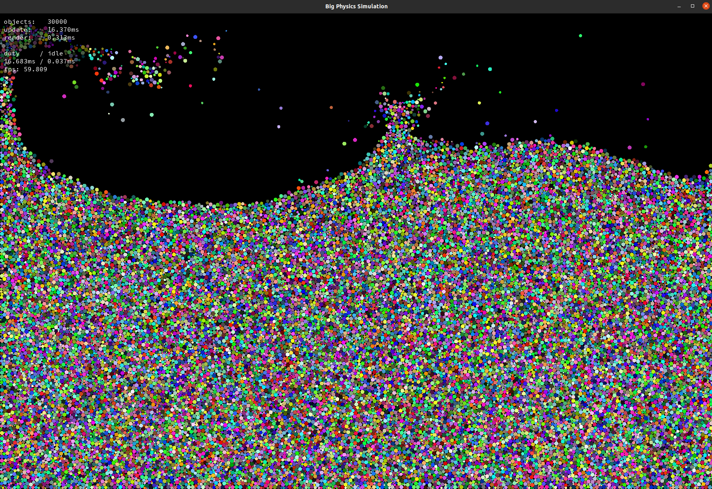

# Big Physics Simulation



## Features
* Objects rendered in one single draw call as sprites on quads via vertex array
* Objects collide with each other
* Some kind of basic space partitioning
* Multithreading on collision checks ( altough, not the finest )

## Notes
Sometimes the simulation can go haywild if there's too much entropy in the system. For example, crank up the gravity to 600 or something and watch a new universe get born. I can battle this behaviour by increasing the amount of sub-steps used for the world update, but that obviously decreases the performance..

My space partitioning is very naive and just divides room in cells twice the size of objects max-radius. This leaves a good amount of empty cells in half-empty rooms after objects settle at the bottom. I believe there's quite some room for optimizations.

For the multithreading, 8 threads split up the work of updating the objects each sub-step. Each thread work on chunks of the space partitioning grid in the form of columns. This means that it'll perform better on wide worlds in most cases, as the objects typically collect uniformly on the ground. For now, the threading code is quite ugly, but it does the work..

On my PC I can simulate about ~30000 objects (2-6px radii) in a 1800x1200 world, with 6 sub-steps on the update. I would like to get to above 50k.

__My specs:__
* Ubuntu 20.04.1
* 11th Gen Intel(R) Core(TM) i7-11700KF @ 3.60GHz
* Nvidia Geforce RTX 3070

## PreReq
SFML - Easy window handling, rendering, events etc.
```
sudo apt-get install libsfml-dev
```

## Building the Project

```bash
mkdir build
cd build
cmake ..
make
```

## Running the Project
Usage

```bash
./big_physics_sim [options]
Options:
  --width <width>          Set the window width
  --height <height>        Set the window height
  --min-radius <radius>    Set the minimum circle radius
  --max-radius <radius>    Set the maximum circle radius
  --spawn-limit <amount>   Set the maximum number of objects
  --spawn-amount <amount>  Set the number of objects to spawn per frame (0 = spawn all objects at once)
  --gravity <value>        Set the gravity value
  --rain                   Enable rain mode
  --help, -h               Display this help message

example:
./big_physics_sim --width 1600 --height 900 --max-radius 6.5 --spawn-limit 16000 --spawn-amount 25 --rain
```

Default values used when omitting an option:
```bash
width: 1800
height: 1200
min-radius: 2.0
max-radius: 6.0
spawn-limit: 25000
spawn-amount: 0
gravity: 200.0
rain: false
```